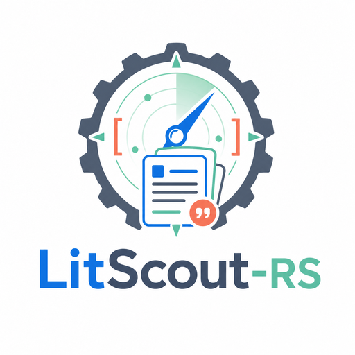
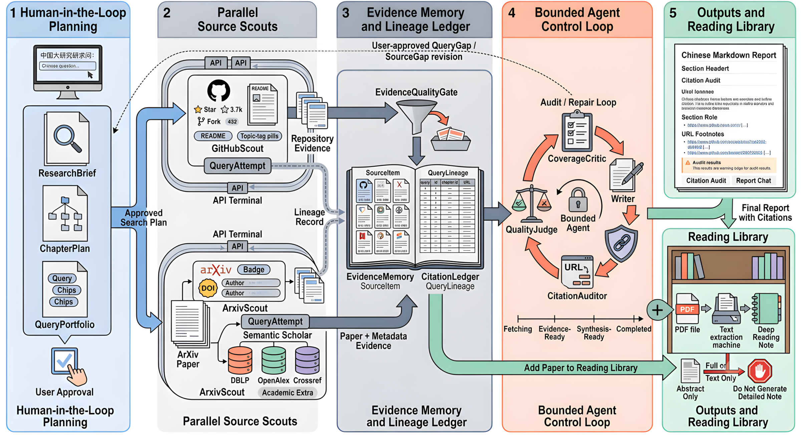

# LitScout-RS

<p align="center">
  English | <a href="README.zh-CN.md">简体中文</a>
</p>

<p align="center">
  
</p>

<p align="center">
  <strong>Evidence-gated research scouting agent built with Rust.</strong>
</p>

<p align="center">
  <a href="https://www.rust-lang.org/"></a>
  
  
  
  
</p>

LitScout-RS is a Rust-based research scouting agent for turning a research topic into an auditable, cited survey report and follow-up paper reading workflow.

The project is designed for course research, early-stage literature surveys, open-source technology selection, and research-oriented development. It does not try to behave like an unrestricted browser agent. Instead, it collects evidence from controlled sources, records how each item was found, filters noisy academic candidates, audits citation boundaries, and lets users continue from a generated report into paper-level reading notes and Q&A.

## Highlights

- **Research workflow, not just search results**: generates a research brief, chapter plan, query portfolio, evidence memory, coverage report, citation audit, and final Markdown report.
- **Controlled multi-source collection**: uses GitHub and arXiv by default, with optional Stage A academic expansion through Semantic Scholar, DBLP, OpenAlex, and Crossref.
- **Evidence-first report generation**: the writer can only cite URLs registered in `CitationLedger`; source lineage and query attempts remain inspectable.
- **Accuracy-oriented expansion**: academic candidates go through canonical merge, ranking, classification, and `EvidenceQualityGate` before entering the report evidence pool.
- **Stateful agent control loop**: state transitions, trace events, checkpoints, and PlanReady branching make each run reviewable instead of opaque.
- **Integrated paper reading library**: arXiv papers from the evidence pool can be added to the reading library for full-text or near-full-text fetching, structured notes, and single-paper follow-up Q&A.
- **Rust backend with typed boundaries**: API responses, sessions, checkpoints, evidence models, and LLM outputs are represented with typed Rust structures and serde-compatible JSON.

## System Workflow

<p align="center">
  
</p>

```text
User research topic
  -> Scoper creates ResearchBrief
  -> Planner creates ChapterPlan and QueryPortfolio
  -> PlanCritic reviews plan quality
  -> User approves or revises the plan
  -> GitHubScout / ArxivScout collect default evidence
  -> Optional AcademicScout collects Semantic Scholar / DBLP / OpenAlex / Crossref
  -> EvidenceBuilder performs canonical merge, ranking, classification, and EvidenceQualityGate
  -> EvidenceMemory and CitationLedger are built with query lineage
  -> CoverageCritic checks chapter-level evidence gaps
  -> Writer generates a cited Markdown report
  -> CitationAuditor checks URL whitelist, citation coverage, and source diversity
  -> Reading Library supports arXiv paper notes and single-paper Q&A
```

The LLM is not allowed to browse freely or invent sources. It receives only evidence collected and registered by LitScout-RS, and final citations are checked against the citation ledger.

## Architecture at a Glance

```text
src/
  main.rs                 # entry point and web server startup
  cli.rs                  # command-line options
  config.rs               # AppConfig and environment handling
  model.rs                # SourceItem, EvidenceMemory, CitationLedger, run models
  sources/                # GitHub, arXiv, Semantic Scholar, DBLP, OpenAlex, Crossref
  agent/                  # scoper, planner, scouts, evidence builder, writer, auditors
  reading/                # arXiv reading library, text fetching, notes, paper Q&A
  server/                 # axum routes and SSE endpoints
  ranking.rs              # ranking signals
  dedup.rs                # canonical work merge
  classify.rs             # evidence classification
  checkpoint.rs           # secret-safe checkpoints
  trace.rs                # jsonl run trace
web/src/
  components/             # React workbench views
  api/                    # typed frontend API client
```

## Requirements

- Rust stable toolchain with Cargo
- Node.js and npm for the web workbench
- DeepSeek-compatible chat completion endpoint
- Optional GitHub token for higher GitHub API rate limits

## Configuration

LitScout-RS reads runtime configuration from CLI flags and environment variables. A reference profile is documented in `config.example.toml`.

```bash
export DEEPSEEK_API_KEY=...
export DEEPSEEK_BASE_URL=https://api.deepseek.com
export DEEPSEEK_MODEL=deepseek-v4-pro
export DEEPSEEK_SIDE_MODEL=deepseek-v4-flash
export DEEPSEEK_MAX_TOKENS=4096
export DEEPSEEK_TIMEOUT_SECS=30

# Optional, recommended for GitHub rate limits.
export GITHUB_TOKEN=...

# Optional academic expansion providers.
export SEMANTIC_SCHOLAR_API_KEY=...
export OPENALEX_API_KEY=...
export CROSSREF_MAILTO=you@example.com
```

Do not commit real API keys. Checkpoints and traces are designed not to persist secrets, but environment variables and local shell history still need normal care.

## Quick Start: Web Workbench

Build the frontend and start the Rust server:

```bash
cd web
npm install
npm run build
cd ..

cargo run -- --serve --port 3000
```

Open:

```text
http://127.0.0.1:3000
```

Recommended web workflow:

1. Configure DeepSeek and optional GitHub token.
2. Create a research run from a Chinese or English topic.
3. Review the generated plan before collection starts.
4. Approve the plan and watch run progress, events, and checkpoints.
5. Inspect evidence, query lineage, coverage, and citation audit.
6. Read the generated Markdown report.
7. Add useful arXiv papers to the reading library for notes and single-paper Q&A.

Academic expansion is explicit. Enable it in the workbench policy only when you want Semantic Scholar, DBLP, OpenAlex, and Crossref to participate in the evidence pool.

## CLI Usage

The current main path requires LLM mode:

```bash
cargo run -- "rust agent framework" --llm
cargo run -- "llm tool calling" --llm --github-limit 10 --arxiv-limit 10
cargo run -- "llm agent benchmark" --llm --academic-extra --academic-limit 10
```

DeepSeek options may be provided through flags when needed:

```bash
cargo run -- "rust agent framework" --llm \
  --deepseek-api-key "$DEEPSEEK_API_KEY" \
  --deepseek-base-url https://api.deepseek.com \
  --deepseek-model deepseek-v4-pro \
  --deepseek-side-model deepseek-v4-flash \
  --llm-timeout 45 \
  --llm-max-tokens 4096
```

Reports are written to `reports/<topic>-<timestamp>.md`. Session summaries, traces, and checkpoints are written under `sessions/` without API keys.

## Web Workbench Features

- Plan review and revision before evidence collection.
- SSE-based run progress for fetching, evidence building, synthesis, and audit stages.
- Evidence memory with source links, query attempts, lineage, and selection summary.
- Coverage matrix for chapter-level `QueryGap` and `SourceGap` diagnostics.
- Citation audit for URL whitelist checks, citation coverage, and source diversity.
- Checkpoint listing and PlanReady branch creation.
- Markdown report preview.
- Reading library for arXiv paper ingestion, text-fetch diagnostics, structured notes, and single-paper streaming Q&A.

## API Overview

Core endpoints:

- `GET /api/health`
- `POST /api/plan`
- `POST /api/plan/revise`
- `POST /api/run`
- `POST /api/run/stream`
- `POST /api/report/translate`

Stateful run endpoints:

- `POST /api/runs`
- `GET /api/runs/:run_id`
- `GET /api/runs/:run_id/events`
- `POST /api/runs/:run_id/approve-plan`
- `POST /api/runs/:run_id/continue`
- `POST /api/runs/:run_id/revise-plan`
- `GET /api/runs/:run_id/evidence`
- `GET /api/runs/:run_id/coverage`
- `GET /api/runs/:run_id/citation-audit`
- `GET /api/runs/:run_id/checkpoints`
- `POST /api/runs/:run_id/branch-from-checkpoint`

Reading library endpoints:

- `GET /api/library`
- `POST /api/library/items`
- `GET /api/library/items/:paper_key`
- `DELETE /api/library/items/:paper_key`
- `POST /api/library/items/:paper_key/generate-note`
- `POST /api/library/items/:paper_key/chat/stream`

Report-level follow-up endpoints have been removed. Follow-up Q&A now belongs to the reading library, where the context is a single paper.

## Development Checks

Rust:

```bash
cargo fmt
cargo check
cargo test
```

Frontend:

```bash
cd web
npm run build
```

Stage 3 fixture bench:

```bash
node scripts/stage3_eval.mjs
```

The mini bench validates the control-loop structure with fixture/mock data. It does not replace live GitHub, arXiv, academic-source, or LLM integration checks.

## Current Boundaries

- Default sources are GitHub and arXiv.
- Stage A academic expansion is opt-in through `--academic-extra` or the web run policy.
- Open web search, browser automation, unrestricted ReAct, WeChat crawling, and general-purpose news crawling are intentionally out of scope.
- Academic-index and bibliography candidates must pass `EvidenceQualityGate` before entering `EvidenceMemory` and `CitationLedger`.
- The reading library is currently focused on arXiv papers. It can fetch text through Jina Reader and local PDF extraction, but it is not a general PDF/document analysis system.
- `CoverageCritic` reports gaps and suggestions; it does not start an open-ended autonomous crawling loop.
- Branching currently supports creating a new run from a PlanReady checkpoint.
- Paper chat uses an SSE interface. The current backend may buffer model output before sending Markdown chunks; token-native streaming can be added later.

## Repository Hygiene

Recommended GitHub project settings:

- Add a concise repository description, for example: `Rust research scouting agent with evidence-gated multi-source search, cited reports, and arXiv reading notes.`
- Add topics such as `rust`, `llm`, `research-agent`, `literature-review`, `arxiv`, `github-api`, `evidence`, `citation-audit`.
- Add a license file if this repository is intended to be public or reused.
- Keep `.env`, API keys, generated sessions, local cache, and private reports out of commits.
- Add screenshots or architecture diagrams under a tracked `docs/assets/` directory if you want the README to show images on GitHub.

## License

No license file is currently included. If the project will be published or reused, add an explicit license before release.
